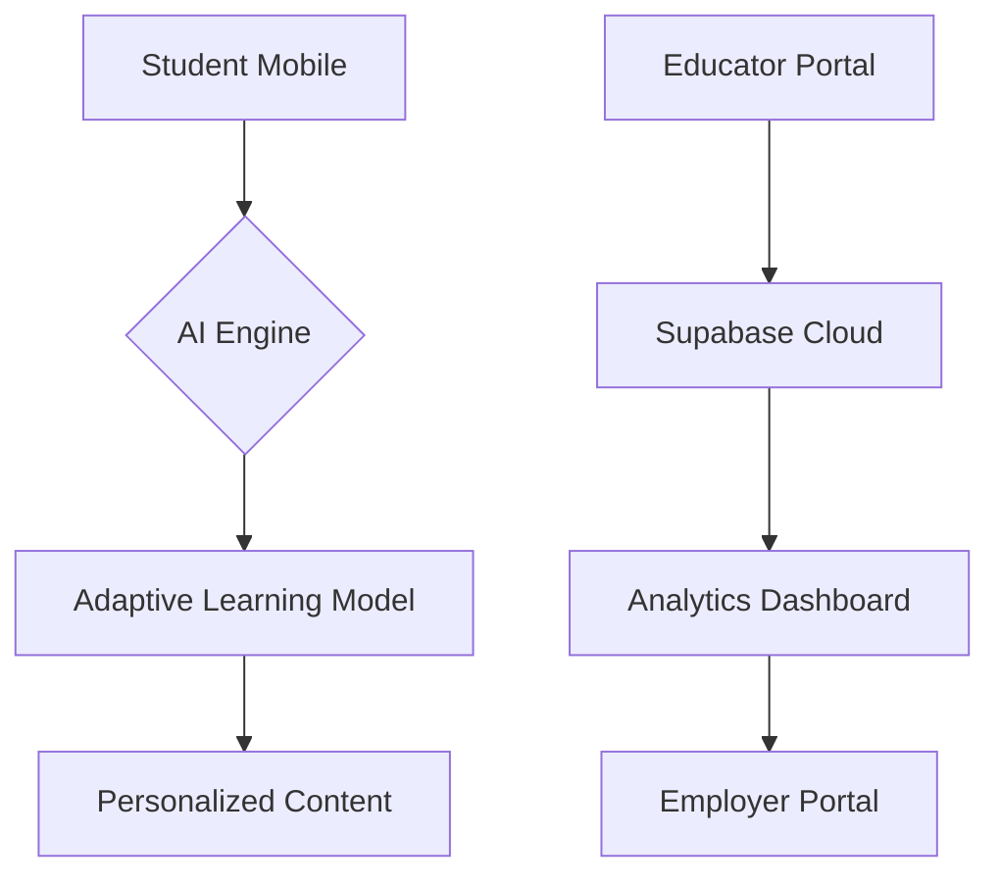

# VidyaVahini 📚🌍  
**Revolutionizing Education Access Through Adaptive Technology**  
[Live Demo] | [Report Bug] | [Request Feature]

## Table of Contents
- [The Educational Crisis](#the-educational-crisis)
  - [Student Challenges](#student-challenges)
  - [Educator Struggles](#educator-struggles)
  - [Employer Dilemmas](#employer-dilemmas)
- [Our Solution](#our-solution)
  - [For Students](#for-students)
  - [For Educators](#for-educators)
  - [For Employers](#for-employers)
- [Technology Stack](#technology-stack)
- [SDG Alignment](#sdg-alignment)
- [Installation](#installation)
- [Contributing](#contributing)
- [Contact](#contact)

## The Educational Crisis
### Student Challenges
🚨 **Critical Issues in Underserved Communities:**
1. **Access Barrier:** 263 million youth worldwide lack school access (UNESCO)
2. **Language Divide:** 40% students can't access content in native languages
3. **Digital Desert:** 72% rural schools lack reliable internet (ITU data)
4. **Employment Gap:** 58% graduates remain unemployable due to skill mismatch
5. **Personalization Void:** 1:50 teacher-student ratio prevents individualized attention

📉 **Consequences:**
- 34% dropout rate before secondary education
- 2.8x lower literacy rates in rural areas
- 60% wage gap for underserved community graduates

### Educator Struggles
🚨 **Systemic Challenges:**
1. **Resource Scarcity:** 89% teachers lack digital teaching tools
2. **Overload:** Average 58 students per classroom
3. **Assessment Burden:** 12 hours/week spent on manual grading
4. **Isolation:** Limited peer collaboration opportunities
5. **Training Deficit:** 3-year gaps in professional development

📉 **Consequences:**
- 42% teacher attrition rate in rural areas
- 67% outdated curriculum usage
- 8:1 student-content mismatch ratio

### Employer Dilemmas
🚨 **Hiring Challenges:**
1. **Skill Gap:** 75% employers report education-job mismatch
2. **Access Barrier:** 82% qualified candidates remain undiscovered
3. **Verification Issues:** 49% fraudulent credential cases reported
4. **Diversity Deficit:** 68% companies lack rural talent pipeline
5. **Training Costs:** $1,286/employee spent on remedial training

📉 **Consequences:**
- 9-month average time-to-hire for technical roles
- $4.3B annual loss due to skill gaps
- 34% lower productivity in new hires

## Our Solution
### For Students
🎯 **VidyaVahini's Intervention:**
1. **AI-Powered Learning Companion**
   - Voice/Image-enabled chatbot (supports 22 regional languages)
   - Adaptive learning paths based on competency mapping
   - Example: Rural student solves math problems via voice chat

2. **Offline-First Design**
   - Progressive Web App works on 2G networks
   - 500MB cached educational content
   - Syncs progress when connectivity resumes

3. **Skill-to-Career Pipeline**
   - Micro-credential system with employer-recognized badges
   - Direct application portal with 150+ partner companies
   - Example: Tribal student becomes certified cloud practitioner

4. **Multilingual Ecosystem**
   - Content available in 8 Indian languages
   - Real-time translation for English resources
   - Cultural context integration in lessons

### For Educators
🎯 **Empowerment Tools:**
1. **Smart Course Builder**
   - AI-assisted content creation (40% time reduction)
   - Collaborative lesson planning dashboard
   - Example: Rural teacher creates interactive science module

2. **Real-Time Analytics**
   - Student performance heatmaps
   - Early warning system for at-risk students
   - Automated assessment generation

3. **Professional Network**
   - Peer-to-peer resource sharing
   - Monthly virtual training workshops
   - Certification programs with NGOs

4. **Low-Bandwidth Classroom**
   - Live class functionality at 256kbps
   - Asynchronous discussion forums
   - Offline assignment submission

### For Employers
🎯 **Talent Solutions:**
1. **Skill-First Hiring**
   - Verified competency badges
   - AI-matched candidate profiles
   - Example: IT company finds Python-certified rural graduates

2. **Direct Outreach**
   - Geo-targeted job postings
   - Virtual career fairs
   - Campus recruitment automation

3. **Training Partnerships**
   - Custom skill development programs
   - Apprenticeship management system
   - Diversity hiring analytics

4. **Credential Verification**
   - Blockchain-backed certificates
   - Skill competency reports
   - Performance analytics sharing

## Technology Stack
**Core Architecture:**

-Frontend:
  -React + TypeScript
  -shadcn-ui Component Library
  -Tailwind CSS + Radix UI

-Backend:
  -Supabase (PostgreSQL)

## How can I edit this code?

There are several ways of editing your application.

**Use your preferred IDE**

If you want to work locally using your own IDE, you can clone this repo and push changes. Pushed changes will also be reflected in Lovable.

The only requirement is having Node.js & npm installed - [install with nvm](https://github.com/nvm-sh/nvm#installing-and-updating)

Follow these steps:

```sh
# Step 1: Clone the repository using the project's Git URL.
git clone <YOUR_GIT_URL>

# Step 2: Navigate to the project directory.
cd <YOUR_PROJECT_NAME>

# Step 3: Install the necessary dependencies.
npm i

# Step 4: Start the development server with auto-reloading and an instant preview.
npm run dev
```

**Edit a file directly in GitHub**

- Navigate to the desired file(s).
- Click the "Edit" button (pencil icon) at the top right of the file view.
- Make your changes and commit the changes.

**Use GitHub Codespaces**

- Navigate to the main page of your repository.
- Click on the "Code" button (green button) near the top right.
- Select the "Codespaces" tab.
- Click on "New codespace" to launch a new Codespace environment.
- Edit files directly within the Codespace and commit and push your changes once you're done.

## What technologies are used for this project?

This project is built with .

- Vite
- TypeScript
- React
- Tailwind CSS
